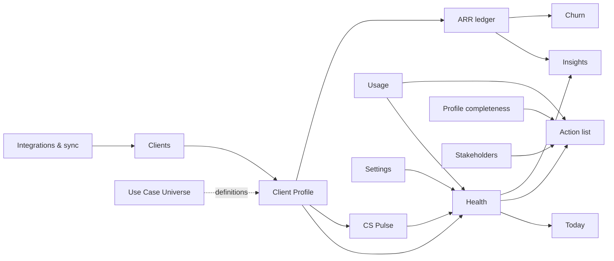

# Signal — Product Map

**Status:** Verified (routes, navigation, access gates read directly from source)
**Last verified:** 2026-08-05 · **Commit:** `9d83a22`

Answers: *where does this live · how does a user reach it · what else does it affect ·
which files implement it.*

---

## 1. Primary navigation

Defined in [`components/layout/Sidebar.tsx:20-31`](../components/layout/Sidebar.tsx).
Every item is shown to every signed-in user — **the sidebar does not filter by role**.
Access control happens inside each page.

| # | Label | Route | Documentation |
|---|---|---|---|
| 1 | Today | `/today` | [today](product/today/README.md) |
| 2 | Clients | `/clients` | [clients](product/clients/README.md) |
| 3 | Expansion | `/expansion` | [expansion](product/expansion/README.md) |
| 4 | Action list | `/inbox` | [action-list](product/action-list/README.md) |
| 5 | Playbooks | `/playbooks` | [playbooks](product/playbooks/README.md) — **non-functional** |
| 6 | Insights | `/reports` | [insights](product/insights/README.md) |
| 7 | Use Case Universe | `/use-cases` | [use-case-universe](product/use-case-universe/README.md) |
| — | Settings *(bottom nav)* | `/settings` | [settings](product/settings/README.md) |

`/` is not a page — it redirects to `/clients` ([`app/(app)/page.tsx`](../app/%28app%29/page.tsx)).
**Clients, not Today, is the application's home.**

Also in the shell: the notifications bell (`components/layout/NotificationsBell.tsx`,
links to `/inbox`) and the theme toggle. `/import` exists as a route but has **no
navigation entry** — it is reachable only by direct URL or from the Clients page import
dialog.

## 2. Secondary navigation

**Insights** — real subroutes, not tabs, each on a different clock
([`components/reports/InsightsNav.tsx`](../components/reports/InsightsNav.tsx)). Every
link carries the current query string forward, because filters live in the URL.

| Label | Route | Time base |
|---|---|---|
| Overview | `/reports` | Selected period |
| Health | `/reports/health` | As of today (no history exists) |
| Pulse | `/reports/pulse` | Current pulse state |
| Churn | `/reports/churn` | Own picker, defaults to all time |

**Client Profile** — 10 tabs
([`components/clients/ClientProfileTabs.tsx:212-223`](../components/clients/ClientProfileTabs.tsx)):
General information · Stakeholders · Communication · Attachments · Usage · Support ·
Satisfaction indicator · Project Management · Notes · **Health signals**.

The last tab was labelled "Action list" until 2026-08-05. **The tab key stays `actions`**, so
every saved link still resolves — only the label moved. See
[health §4](product/health/README.md).

**Communication** has three sub-tabs: Emails · Meetings · Contacts. Its fourth, *Stakeholder
Mapping*, was removed 2026-08-05 (`9d83a22`) along with the write path behind it — see
[stakeholders](product/stakeholders/README.md).

**Settings** — **6** tabs, role-gated at the tab list
([`app/(app)/settings/page.tsx:65-72`](../app/%28app%29/settings/page.tsx)):

| Tab | Visible to |
|---|---|
| Members | Admin + Super Admin |
| Properties | Everyone (read-only below Super Admin for system fields) |
| Projects | Everyone |
| Client health | Admin + Super Admin |
| Churn taxonomy | Admin + Super Admin |
| Integrations | Everyone *(secrets and full re-sync gated to Super Admin inside)* |

**Automations is gone** (2026-08-03, `07db772`) — it configured the auto-assignment engine,
which was removed. See [assignment](business-rules/assignment.md).

## 3. Route inventory

### Application pages (`app/(app)/`, inside the authenticated shell)

| Route | File | Purpose |
|---|---|---|
| `/` | `app/(app)/page.tsx` | Redirect → `/clients` |
| `/today` | `app/(app)/today/page.tsx` | Personal daily worklist |
| `/clients` | `app/(app)/clients/page.tsx` | Account directory |
| `/clients/[id]` | `app/(app)/clients/[id]/page.tsx` | Client Profile (10 tabs) |
| `/expansion` | `app/(app)/expansion/page.tsx` | Expansion opportunities — board and list |
| `/inbox` | `app/(app)/inbox/page.tsx` | Action list |
| `/playbooks` | `app/(app)/playbooks/page.tsx` | Playbooks — always empty |
| `/reports` | `app/(app)/reports/page.tsx` | Insights overview / retention |
| `/reports/health` | `app/(app)/reports/health/page.tsx` | Health distribution & drag (**re-pointed at the engine 2026-08-05**, `abd355e`) |
| `/reports/pulse` | `app/(app)/reports/pulse/page.tsx` | CS Pulse coverage |
| `/reports/churn` | `app/(app)/reports/churn/page.tsx` | Churn analysis |
| `/use-cases` | `app/(app)/use-cases/page.tsx` | Use Case Universe directory |
| `/use-cases/[id]` | `app/(app)/use-cases/[id]/page.tsx` | Use-case definition detail |
| `/use-cases/write` | `app/(app)/use-cases/write/page.tsx` | Definition writer |
| `/settings` | `app/(app)/settings/page.tsx` | Workspace administration |
| `/import` | `app/(app)/import/page.tsx` | Bulk client import (no nav entry) |
| `/sign-in/[[...sign-in]]` | `app/sign-in/…` | Clerk sign-in (public) |

### Prototype routes — **not product**

**Twelve** at `9d83a22`: `app/scratch-clients`, `scratch-health`, `scratch-health-card`,
`scratch-health-evidence`, `scratch-insights`, `scratch-model-editor`, `scratch-pulse`,
`scratch-settings`, `scratch-settings-tabs`, `scratch-task-detail`, `scratch-tasks`,
`scratch-usecases`. Outside the app shell, no navigation, no documentation. They are
authenticated (middleware protects everything not explicitly public), but they ship in the
production build. `/scratch-wf` was deleted in commit `8f00fed` after it served the whole
staff directory to anonymous users.

`scratch-tasks` and `scratch-health-evidence` (both 2026-08-03) exist because reading or
posting a task thread needs a Clerk session and a local environment has none — they render the
shipping components against sample data. `scratch-tasks` carries a `NODE_ENV` guard that 404s
it off any deployment, reads no data and touches no permission gate. They are **tracked rather
than gitignored deliberately**: Tailwind v4's automatic source detection skips gitignored
paths, so an ignored preview route renders with a partial stylesheet and misrepresents how the
real thing looks.

### API routes

| Route | Auth | Purpose |
|---|---|---|
| `POST /api/sync` | `SYNC_SECRET` bearer, **public to middleware** | Full HubSpot → Intercom → Metabase sync |
| `GET /api/sync` | same | Which sources are configured |
| `/api/cron/sync` | `CRON_SECRET` | HubSpot sync (`0 */4 * * *`) |
| `/api/cron/usage-sync` | `CRON_SECRET` | Metabase usage (`15 */4 * * *`) |
| `/api/cron/survey-sync` | `CRON_SECRET` | Intercom surveys (`30 5 * * *`) |
| `/api/cron/intercom-sync` | `CRON_SECRET` | Intercom tickets (`0 6 * * *`) |
| `/api/cron/profile-completeness` | `CRON_SECRET` | Completeness sweep (`0 7 * * *`) |
| `/api/cron/client-actions` | `CRON_SECRET` | Regenerate Action list (`0 8 * * *`) |
| `/api/cron/client-health` | `CRON_SECRET` | Recompute health (`0 9 * * *`) |
| `/api/clients`, `/api/clients/[id]` | Clerk session | Client reads |
| `/api/deals/[id]` | Clerk session | Deal reads |
| `/api/admin/csm-users`, `/api/admin/properties`, `/api/admin/stakeholder-config` | Clerk session + role | Admin config |
| `/api/import/clients` | Clerk session | Import execution |
| `/api/churn-import`, `/api/add-account`, `/api/usage-refresh` | secret bearer, public to middleware | One-off backfills |

Cron routes are **excluded from Clerk protection** in
[`middleware.ts:12-31`](../middleware.ts) — Vercel's scheduler has no session — and are
instead gated by their own `CRON_SECRET` check. An unset `CRON_SECRET` is a **503 refusal
in production**, not a bypass.

### Server actions (writes)

Signal writes almost entirely through server actions, not REST.

| File | Owns |
|---|---|
| `app/(app)/clients/[id]/actions.ts` | Client field edits, ARR events, archive |
| `…/contact-actions.ts` · `…/stakeholder-actions.ts` | Contacts, stakeholder profiles |
| `…/note-actions.ts` · `…/attachment-actions.ts` | Notes, attachments |
| `…/project-actions.ts` | Projects, milestones, project tasks |
| `…/health-actions.ts` · `…/usage-actions.ts` | Health override, usage refresh |
| `…/use-case-actions.ts` · `…/use-case-implementation-actions.ts` | Account use cases |
| `…/owner-actions.ts` | Owner reassignment (**super-admin only, every path**) |
| `app/(app)/clients/churn-actions.ts` · `pulse-actions.ts` | Churn tagging, CS Pulse |
| `app/(app)/inbox/actions.ts` · `client-actions.ts` | Action list dismiss/complete/regenerate |
| `app/(app)/today/task-actions.ts` · `note-actions.ts` · `triage-actions.ts` | Today tasks, notes, triage |
| `app/(app)/today/task-update-actions.ts` | Task update threads, mention audience (**read is gated on write**) |
| `app/(app)/use-cases/actions.ts` · `taxonomy-actions.ts` · `transfer-actions.ts` | Definitions, taxonomy, export/import |
| `app/(app)/settings/*-actions.ts` | Members, roles, project config, churn taxonomy |
| `app/(app)/settings/client-health-actions.ts` | Health model weights, bands, gates and status rules — **saving re-scores every account** |

## 4. Page → sections → actions

### `/today`
Sections: portfolio pulse · top priorities · focus-area lanes (de-risking, projects,
escalations, expansion, stakeholders) · tasks · change feed.
Actions: add task · complete task · mark priority reviewed · snooze priority · open
account drawer · add note.
Affects: `today_tasks`, `workspace_config` (`today_triage:{email}`), `client_notes`.

### `/clients`
Sections: filters · account table (owner, ARR, health, renewal, status).
Actions: add client · import · assign owner (super-admin) · open profile.
Affects: `clients`. **New accounts arrive unowned** — auto-assignment was removed
2026-08-03 (`07db772`); the sync now warns how many need an owner rather than guessing.

### `/clients/[id]`
Sections: header card (ARR, health, owner, renewal) · CS Pulse trigger · 10 tabs
(the tenth is **Health signals**, renamed from "Action list" 2026-08-05; the tab key stays
`actions` so saved links still work).
Actions: edit fields · record ARR event · set/override health · capture CS Pulse ·
add/edit stakeholders · upload attachments · write notes · manage projects · associate
use cases and record implementations · reassign owner (super-admin) · tag churn reason.
Affects: nearly every entity. This is the product's write surface.

### `/inbox`
Sections: filterable action feed.
Actions: complete · dismiss · regenerate · navigate to account.
Affects: `client_actions`.

### `/reports*`
Sections: period controls and filters (in the URL) · summary row · revenue waterfall ·
retention trend · movement · concentration · at-risk · forward outlook · health drag ·
churn panels.
Actions: change period, compare mode, owner/segment filters. **Read-only.**

### `/use-cases`
Sections: hero + search · checkbox filter rail (Category / Product / Adoption) · card grid
ordered by most-adopted · definition drawer · taxonomy manager · transfer (export/import).
Actions: create/edit/retire definitions · manage categories · **link a use case to an
account** · export the Universe · preview an import · apply an import · reset the database.
Every Universe write, destructive included, is `isAdminOrSuper`.
Affects: `workspace_config.use_case_taxonomy`, `workspace_config.use_case_library`, and —
via the link dialog — `clients.properties.use_case_implementations`.

### `/settings`
See §2 for tabs and gates. Affects `app_users`, `property_definitions`,
`workspace_config`, `project_templates`, `csm_users`.

## 5. Dependencies between product areas

Read this as: **changing the health model in Settings re-scores every account immediately,
which changes the clients list, the profile, Today, the Action list and Insights.** Changing the churn taxonomy changes the Churn page and the profile's churn
banner. Changing permissions changes what every page returns.

## 6. Access by area

Enforced server-side. `seesAllClients` / `editsAllClients` / `canSeeClient` /
`canEditClient` in [`lib/auth.ts`](../lib/auth.ts) and [`lib/roles.ts`](../lib/roles.ts).

| Area | Super Admin | Admin | Operator | Guest |
|---|---|---|---|---|
| Today | All accounts | All accounts | Owned only | All, read-only |
| Clients / Profile — view | All | All | Owned/granted only | All |
| Clients / Profile — edit | Yes | Yes | Owned/granted only | **No** |
| Owner reassignment | **Yes** | No | No | No |
| Action list | All | All | Own | View only |
| Insights | All | All | Scoped to visible accounts | All |
| Use Case Universe — definitions | Full | Full | View only | View |
| Use Case Universe — link an account | All | All *(scope permitting)* | Owned only | **No** |
| Use Case Universe — apply import, reset | **Yes** | **No** | No | No |
| Settings → Members / Client health / Churn | Yes | Yes | No | No |
| Settings → Integrations secrets, full re-sync | **Yes** | No | No | No |

Scope can be narrowed further per user via `app_users.scope` (`all` / `assigned` /
`selected`) and `user_account_grants`. **Super Admin can never be narrowed.**

---

**Documentation status:** Verified
**Last verified:** 2026-07-31 · **Commit:** `15329e3` · **Owner:** Unassigned
