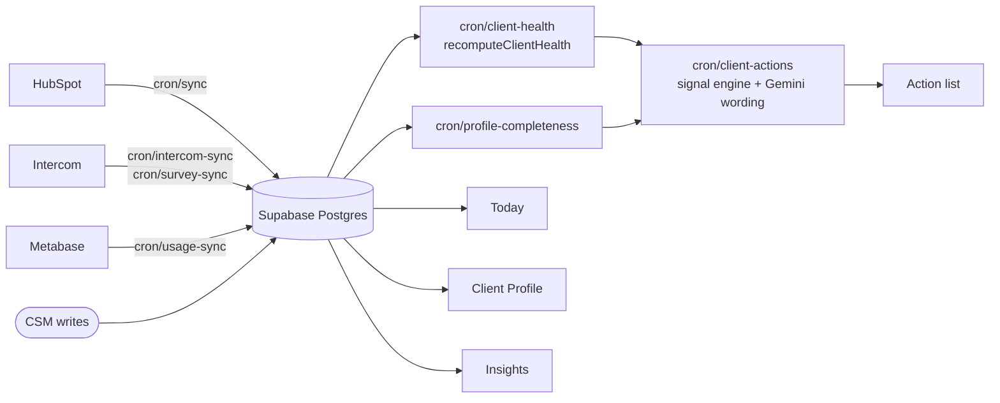
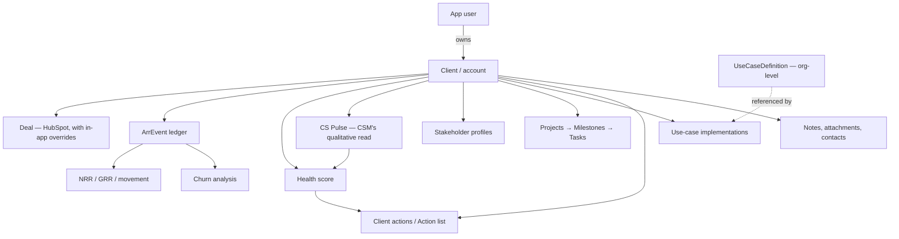

# Signal — Product Overview

**Status:** Partially verified
**Last verified:** 2026-08-05 · **Commit:** `9d83a22`
(§9's limitations rewritten at this commit after the health-engine switch, the
assignment-engine removal and the stakeholder cutover. §1–§8 last read at `4214349` and
re-checked, not re-written.)

> Written for someone who understands SaaS and Customer Success but has never seen Signal.
> This describes the product that exists in this repository. Where something is planned,
> half-built, or contradictory, it says so.

---

## 1. What Signal is

Signal is Lumofy's **internal Customer Success operating system**. It is not sold; it is
used by Lumofy's own CS, Implementation, Revenue and Leadership functions to run the
customer book.

In code it is `lumofy-signals` (`package.json`); the README and page titles call it
"Lumofy Signals". "Signal" is the name used in conversation and in this documentation.

Signal exists because the facts needed to run an account were spread across three systems
and none of them held the parts a CSM actually decides on:

| System | Holds | Does not hold |
|---|---|---|
| **HubSpot** | The customer list, owners, firmographics, deals, contract fields | Health, qualitative read, delivery work, stakeholder intelligence |
| **Intercom** | Support tickets, first-response time, CSAT, NPS surveys | Anything about the account beyond support |
| **Metabase** | Product usage — seats, active users, adoption, stickiness | Anything commercial or relational |

Signal pulls all three into one account record and then adds the layer that had no home:
an ARR event ledger, a health score, the CSM's qualitative read (**CS Pulse**), stakeholder
profiles, delivery projects, notes, and per-account use-case implementations.

**Signal documents the customer relationship. It does not run the product Lumofy sells.**

---

## 2. The problems it solves

1. **"What is actually going on with this account?"** — one profile instead of three tabs.
2. **"Which of my accounts needs me today?"** — the Today page and the Action list turn
   account facts into a ranked, scoped worklist.
3. **"Is this account healthy?"** — a configurable, weighted health score over usage,
   support, satisfaction, onboarding and data completeness.
4. **"What is our retention?"** — NRR/GRR, revenue movement and churn computed from an
   event ledger rather than scraped from deal records.
5. **"Why did we lose them?"** — an admin-editable churn taxonomy and a churn dashboard
   that reports who churned and when.
6. **"What is this customer trying to achieve?"** — a use-case model that separates the
   organisation's canonical definitions from each account's application of them.
7. **"Who owns this account, and who can change it?"** — two owner slots, Super Admin-only
   reassignment, and server-enforced permission scoping. *(Automatic routing was removed
   2026-08-03; new accounts arrive unowned.)*

## 3. Who uses it

| Role (permission tier) | Who they are | What Signal gives them |
|---|---|---|
| **Super Admin** | Platform owner | Everything, plus members, integrations, destructive actions |
| **Admin** | Workspace manager | All accounts, most settings, members — but not admins or integrations |
| **Operator** | CSM / Implementation Manager | Only the accounts they own; the daily worklist |
| **Guest** | Leadership, Revenue, Support, Product | Read-only across the book |

A person's job **title** (`app_users.title`, e.g. "Strategic CSM") is free text and is
**not** a permission. Five legacy granular roles (`strategic_csm`, `senior_csm`,
`csm_officer`, `implementation_officer`, `implementation_manager`) still exist as valid
values and all resolve to `operator`; they are retained because assignment routing targets
seniority bands. See [`lib/roles.ts`](../lib/roles.ts) and
[users-and-permissions](product/users-and-permissions/README.md).

## 4. Major product areas

Primary navigation (`components/layout/Sidebar.tsx`):

| Area | Route | What it answers |
|---|---|---|
| **Today** | `/today` | What needs me right now, across my accounts |
| **Clients** | `/clients` | The account book — and `/` redirects here |
| **Client Profile** | `/clients/[id]` | Everything about one account, in 10 tabs |
| **Action list** | `/inbox` | Generated next steps across my accounts |
| **Playbooks** | `/playbooks` | *Non-functional — see §8* |
| **Insights** | `/reports`, `/reports/health`, `/reports/pulse`, `/reports/churn` | Retention, health, pulse coverage, churn |
| **Use Case Universe** | `/use-cases`, `/use-cases/[id]`, `/use-cases/write` | The canonical use-case library |
| **Settings** | `/settings` | Members, fields, projects, workflows, integrations, taxonomies |
| **Import** | `/import` | Bulk client import |

## 5. How information flows

Two directions of data:

- **Synced, read-mostly** — accounts, owners, deals, contract fields, tickets, CSAT/NPS,
  usage. HubSpot is the source of truth for identity and deal fields; the app layers
  *overrides* on top rather than writing back (`lib/deal-overrides.ts`).
- **Authored in Signal** — ARR events, CS Pulse, stakeholder profiles, projects, notes,
  attachments, use-case implementations, tasks, triage decisions. None of this is synced
  anywhere; Signal is the source of truth.

Seven daily/4-hourly Vercel Cron jobs drive the pipeline, deliberately ordered so each
reads the previous one's output — sync (06:00) → profile-completeness (07:00) →
client-actions (08:00) → client-health (09:00). See
[architecture](architecture/README.md).

## 6. How the core concepts relate

- **Client** is the spine. Almost everything hangs off `clients.id`.
- **Users** own clients through two owner slots — a CSM owner and an Implementation
  owner. Being on *either* slot grants an operator access.
- **Stakeholders** are people at the client: synced HubSpot contacts plus in-app
  relationship profiles that carry influence, sentiment and role.
- **Use cases** are two-level: an organisation-level *definition* and an account-level
  *implementation*. They are deliberately distinct records — see §7.
- **Tasks** exist in two unrelated systems: `today_tasks` (personal, the Today page) and
  `project_tasks` (delivery work under a project). Neither is the "playbook task" table.
- **Health** is a *current condition*. **Risk** is *evidence*. **Renewal** is a
  *commercial outlook*. **Churn** is a *recorded outcome with its own taxonomy*. Four
  different things.
- **ARR** is a running balance over an event ledger, not a field. Revenue movement
  (new business / expansion / contraction / churn) is the event types on that ledger.
- **Renewal and expansion** are surfaced through renewal dates, ARR events and the
  Insights forward outlook. There is no dedicated renewal record.

## 7. The distinctions that matter most

**Use Case Universe vs client use cases.** A definition is written once at organisation
level; an implementation is one account's version, with its own objective, owner, status
and dates. Editing one never touches the other. Implementations are stored on the client
(`clients.properties.use_case_implementations`) precisely so a retired definition cannot
take an account's recorded objective with it.
*Caveat:* Signal currently carries **two unlinked use-case taxonomies** —
see [known limitations](known-limitations/contradictions.md#two-use-case-taxonomies).

**Signals vs tasks.** A signal (`lib/actions/signals.ts`) says something *may* need
attention. A task is explicit work someone committed to. Signals become visible action
items through a named, deterministic rule; they never silently become tasks.

**Health vs churn.** Health answers "how is this account now". Churn is a recorded
outcome, with a reason from an admin-defined taxonomy and its own ARR event. A churned
account is excluded from health, at-risk and concentration analysis — it has no health and
cannot renew.

**ARR vs associated ARR.** Account ARR is the ledger balance. "Associated ARR" on a use
case is the **sum of the ARR of accounts that have that use case recorded** — it
double-counts across use cases and is not a revenue attribution.
See [ARR business rules](business-rules/arr-and-revenue-movement.md).

## 8. Current boundaries of the product

Signal does **not**:

- Write back to HubSpot, Intercom or Metabase. All three are read-only sources.
- Send email or in-product messages to customers. Notifications are internal only.
- Manage contracts, invoices or billing.
- Predict churn. It records churn that has happened.
- Have a public or customer-facing surface.
- Have a mobile app. It is a desktop web application.
- Emit product analytics. There is no analytics SDK in the dependency tree.

## 9. Major known limitations

These are the ones that change how you should read the rest of the documentation.

1. **Playbooks does not work.** `/playbooks` renders, but `getPlaybooks()` and
   `getTasksForClient()` in [`lib/data.ts:572-580`](../lib/data.ts) both return `[]`
   unconditionally. The trigger types (`health_below`, `renewal_within`, …) are declared
   in `lib/types.ts` but **nothing evaluates them**. The page is permanently empty.
   *Status: Deprecated / not implemented.*
2. **The health engine is now the scorer** (2026-08-03, `9a8ea59`). `lib/health/` runs the
   published model — four weighted components, five qualification gates, sixteen status
   rules — and every surface reads the **applied status** it concludes. The switch re-sorted
   the book: 43 "Healthy" became 3, and 79 accounts previously scored as live are now
   correctly `Churned`. Two residues remain: `lib/metrics/health.ts` is dead code with 21
   passing tests, and the engine's 19 tables are still unwritten, so there is **no health
   history**. *Status: Verified, with two residues.*
3. **Two use-case taxonomies**, explicitly uncoupled and sharing no ids.
4. **Twenty test files, 233 tests** — heavily concentrated in health, use cases,
   stakeholders and task updates. **Not one covers a permission gate, an ARR formula, a page
   or (almost) a server action.** Most of this documentation is `Partially verified` at best.
5. **No sample mode**, despite the README. `lib/data.ts` states plainly that the
   sample/demo fallback was removed; an unconfigured database now shows empty states.
   The README still documents sample mode.
6. **README is stale in three places** — sample mode, the cron schedule (it describes 3
   daily jobs; `vercel.json` has 7, five of them sub-daily), and a link to
   `VERCEL-PLAN-CHANGES.md`, which does not exist.
7. **No churn reason field on the event.** 56 of 76 churn events carry only free text
   (`lib/metrics/churn.ts`). The taxonomy exists; the historical data does not use it.
8. **Product state in JSONB.** CS Pulse, stakeholder profiles, use-case implementations
   and deal overrides live in `clients.properties`; taxonomies and config live in
   `workspace_config`. Deliberate — it avoids migrations — but it means the schema alone
   does not describe the product.
9. **`app/scratch-*` prototypes** ship in the build. **Twelve** routes outside the app
   shell. One of them (`/scratch-wf`) was deleted after leaking the staff directory to
   anonymous users (commit `8f00fed`).
10. **Auto-assignment was removed** (2026-08-03, `07db772`). New accounts arrive **unowned**;
    the sync warns how many need an owner rather than guessing. Nothing surfaces that count
    to a person.
11. **The stakeholder mapping matrix was retired** (2026-08-05, `9d83a22`). Profiles are the
    only model and now feed four of the health engine's relationship facts. The legacy data
    is retained as rollback evidence until the cutover is accepted.

Full list: [known-limitations](known-limitations/README.md).

---

## Source references

`package.json` · `README.md` · `components/layout/Sidebar.tsx` · `lib/config.ts` ·
`lib/auth.ts` · `lib/roles.ts` · `lib/data.ts` · `lib/types.ts` · `lib/db/schema.ts` ·
`lib/db/health-schema.ts` · `lib/metrics/*` · `lib/actions/signals.ts` · `vercel.json` ·
`middleware.ts` · `app/**/page.tsx`

**Documentation status:** Partially verified — navigation, routes, permissions, ARR,
churn and health formulas read end to end; workflow-level behaviour is largely untested.
**Last verified:** 2026-08-05 · **Commit:** `9d83a22` · **Owner:** Unassigned
