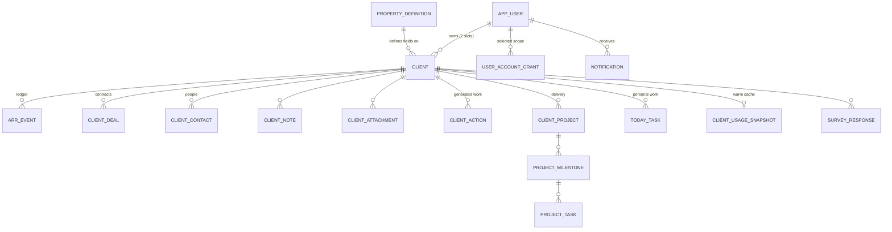

# Data model

**Status:** Partially verified · **Last verified:** 2026-07-31 · **Commit:** `4214349`

The **product-level** model, not a column dump. Signal has 29 tables in
[`lib/db/schema.ts`](../../lib/db/schema.ts) and 19 more in
[`lib/db/health-schema.ts`](../../lib/db/health-schema.ts) — but a large part of the product
does not live in a table at all.

---

## Read this first: three storage tiers

| Tier | What lives there | Why |
|---|---|---|
| **Tables** | Accounts, deals, contacts, notes, attachments, actions, projects, usage, ARR events, users | Normal relational data |
| **`clients.properties` JSONB** | CS Pulse, health snapshot, stakeholder profiles and links, stakeholder mappings, use-case implementations, deal overrides, deal dates | Account-scoped product state that inherits the account's permission scope for free, and can change shape without a migration |
| **`workspace_config` key–value** | Use-case taxonomy, health formula, assignment config, churn taxonomy, role labels, per-user Today triage | Workspace configuration with no natural table, added without migrations |

**Consequence:** reading `schema.ts` alone gives a misleading picture of the product. The
JSONB keys below are as much a part of the data model as the tables.

Writes to `clients.properties` use the **atomic `properties || patch` merge**
(`mergeClientPropertiesDb`), never a whole-object replace, so two concurrent writers cannot
clobber each other's keys.

---

## Core entities

### Client
**Represents:** one customer account. The spine of the product.

**Key fields:** `id` · `hubspotId` (null for imported/manual accounts) · `source` · `name` ·
`domain` · `country` · `industry` · `employees` · `customerType` (default `arr`) ·
`status` · `csm` (JSONB) · `csmSource` (`auto` | `manual`) · `implementationOwner` (JSONB) ·
`implementationOwnerSource` · `currency` · `arr` · `previousArr` · `startedAt` ·
`renewalDate` · `churnedAt` · `segment` · `health` (JSONB) · `support` (JSONB) ·
`usage` (JSONB) · `tags` · `properties` (JSONB).

**Ownership:** two slots — CSM and Implementation. Either grants an operator access.
**Source of truth:** HubSpot for identity and firmographics; Signal for owners, ARR,
health, and everything in `properties`.
**Derived fields:** `arr`, `renewalDate`, `startedAt`, `churnedAt`, `status` — all
materialised from the ARR event ledger by `deriveClientArr`. `health` is materialised by
the daily recompute.
**Lifecycle:** created by sync, import, or `/api/add-account`; ends as `churned`. **No
deletion path exists.**
**Permissions:** the scoping unit for the entire product.

### ArrEvent
**Represents:** one movement on an account's revenue ledger.
**Types:** `new_business` · `renewal` · `expansion` · `reactivation` · `contraction` ·
`churn`.
**Source of truth:** the ledger *is* the truth. HubSpot contributes only `new_business`.
**Derived:** the running `arr` balance is re-stamped on every event when the ledger changes.
**Lifecycle:** append-only in practice — this is the **only fully auditable history in
Signal**.
**Related:** `arr_snapshots` accrues monthly history so period-over-period retention
becomes real over time.

### AppUser
**Represents:** a person with access to Signal.
**Key fields:** email (lower-cased, the join key everywhere) · role · title · department ·
scope · status.
**Not to be confused with:** `csm_users` (the Lumofy staff directory used by assignment
routing) or `client_contacts` (people at the customer).
**Related:** `user_account_grants` for `selected` scope.

### Deal
**Represents:** a HubSpot deal on the account, carrying contract terms.
**Key fields:** amount · licences · complementary licences · price per user · contract
length · products/modules · `use_cases` (JSONB `string[]`) · `tracked` · seven dates ·
`account_executive` → `ownerName`/`ownerEmail` · `use_case_brief` (the sales → CSM handover
brief, synced read-only).
**Source of truth:** HubSpot. **In-app edits are overrides**, stored on the client and
applied on read. Never written back.
**"Tracked"** distinguishes active deals; profile completeness and contract fields only
consider tracked deals.

### Contact and Stakeholder
Three layers, deliberately separate — see
[stakeholders](../product/stakeholders/README.md):
`client_contacts` (HubSpot-synced identity) · `stakeholder_mappings` (role → contact
matrix) · `stakeholder_profiles` (relationship intelligence, JSONB).

### ClientAction
**Represents:** a generated item in the Action list.
**Key fields:** category · `signalKey` (unique within client+category, part of the stable
id) · priority · title · insight · source · status.
**Lifecycle:** generated → refreshed → auto-resolved when the signal clears, **or dismissed
permanently**.
**Source of truth:** regenerated from account facts; not authored.

### Notification
**Represents:** an internal alert **and** an action item — one table serves both.
`readAt` drives the unread bell badge; `status` (`open`/`done`) drives the action list.
Recipient is the lower-cased login email. Deep-links to a client.
**Types:** `assignment_review` · `assignment_needs_admin` · `client_assigned` · `system`.
**Never sent to a customer.**

### Project / Milestone / Task
CSM-authored delivery work. `client_projects` → `project_milestones` → `project_tasks`,
plus `project_templates`. Status is also the kanban column. Not synced from anywhere.

### TodayTask
`today_tasks` — **personal** tasks. Scoped to a person, optionally to an account. The Client
Profile's account-tasks panel reads the *same rows*: one dataset, two views.
**Unrelated** to `project_tasks` and to the unwritten `playbook_tasks`.

### Usage
`client_usage_snapshots` (one row per client — a **warm cache**, not a hard dependency) and
`client_usage_monthly` (history). `syncError` holds the last failure **without clobbering
the last-good snapshot**, so a transient Metabase hiccup never blanks the tab. A stale or
missing row still falls back to a live fetch.

### PropertyDefinition
Admin-defined client fields, grouped (`contract`, `product`), rendered on the profile's
General information tab. Editing **system/default** definitions is Super Admin only.

### WorkspaceConfig
`key` → `value` JSONB. Not a product concept in itself, but the storage for several. See
the JSONB inventory below.

---

## JSONB-resident product state

### On `clients.properties`

| Key | Entity | Documented in |
|---|---|---|
| `cs_pulse` | CS Pulse — the CSM's qualitative read | [health](../product/health/README.md) |
| `cs_health` | Health snapshot / override | [health](../product/health/README.md) |
| `stakeholder_profiles`, `stakeholder_links` | Stakeholder intelligence | [stakeholders](../product/stakeholders/README.md) |
| `stakeholder_mappings` | Role → contact matrix | [stakeholders](../product/stakeholders/README.md) |
| `use_case_implementations` | One account's application of a use case | [use-case-universe](../product/use-case-universe/README.md) |
| deal override keys | In-app edits layered over synced deal fields | [client-profile](../product/client-profile/README.md) |
| `deal_dates` (`DEAL_DATES_KEY`) | Seven editable deal dates | [dates-and-periods](../business-rules/dates-and-periods.md) |
| the churn reason id | Which taxonomy reason this account churned for | [churn](../product/churn/README.md) |

### On `workspace_config`

| Key | Entity |
|---|---|
| `client_health_formula` | Health metrics, weights, tunables, tiers |
| `use_case_taxonomy` | The admin-curated use-case overlay |
| `churn_taxonomy` | Categories → reasons |
| assignment config keys | CSM and Implementation routing rules, capacity bands |
| role label overrides | Workspace display names for roles |
| `today_triage:{email}` | Per-person Today reviewed/snoozed decisions |

---

## Tables that exist and are not written to

| Table | Status |
|---|---|
| `playbooks`, `playbook_tasks` | Feature not implemented — [playbooks](../product/playbooks/README.md) |
| `timeline_events` | `getTimelineForClient()` and `getRecentActivity()` return `[]` |
| `health_*` (19 tables) | The health engine is not wired to any job or route |

Documenting these as live entities would be exactly wrong. They are listed so nobody
mistakes their presence for a feature.

---

## Relationships

---

## Source of truth by concept

| Concept | Source of truth | Overridable? | Recorded how |
|---|---|---|---|
| Account identity, firmographics | HubSpot | No | — |
| Deal terms | HubSpot | **Yes**, in-app override | Stored on the client, applied on read |
| Owners | Signal | Super Admin only | `csmSource` / `implementationOwnerSource` = `auto`/`manual` |
| ARR | Signal (event ledger) | Via a new event | Append-only ledger |
| Health | Signal (daily recompute) | Yes, manual override | `cs_health`; **the override's audit trail is not verified** |
| CS Pulse | Signal (CSM) | It *is* the human input | JSONB with freshness |
| Tickets, CSAT, NPS | Intercom | No | — |
| Usage | Metabase | No | Warm cache + live fallback |
| Use-case definitions | Signal (admin) | — | Retired, never deleted |
| Use-case implementations | Signal (CSM) | — | Per-account JSONB |
| Churn reason | Signal (CSM) | — | One reason id from the taxonomy |

**What happens when sources disagree:** the in-app override wins on read, silently. Nothing
in the UI indicates that a displayed deal value differs from HubSpot's, and nothing pushes
the correction back.

---

## Migrations

`drizzle/0000_goofy_unicorn.sql` … `0004_add_client_notes.sql`, plus hand-maintained
`health-tables.sql`, `health-analytics-views.sql`, `stakeholder-tables.sql`.

⚠️ **`drizzle/meta` is stale.** `npm run db:generate` emits a **full-schema baseline**
rather than an incremental; applying it would clash with live tables. Use the reviewed
extracted SQL, or `db:push` **after reviewing its proposed diff**. Documented in
[`docs/health-engine.md`](../health-engine.md). This is a live operational hazard for anyone
following the README.

Roughly 40 one-off `scripts/*.mjs` files have made schema changes outside the migration
system (`add-*.mjs`, `align-*.mjs`, `cleanup-*.mjs`, `rename-*.mjs`). **The migration
history is not a complete record of the schema's evolution.**

## Known limitations

1. **`drizzle/meta` is stale** and schema changes have been applied by ad-hoc scripts.
2. **`clients.properties` is untyped.** Malformed data is caught only by each module's own
   normaliser.
3. **JSONB state is not queryable across accounts** — no "show me every Champion who left".
4. **Three tables model work** (`today_tasks`, `project_tasks`, `playbook_tasks`) and only
   two are used.
5. **No audit tables in use.** `health_audit_logs` and `timeline_events` are defined and
   unwritten.
6. **`previousArr` is a legacy field** superseded by the ledger; it still exists on the row.

## Open questions

- Should stakeholder profiles and use-case implementations graduate to real tables now that
  they are established features?
- Is `previousArr` still read anywhere, or is it dead?
- Which of the 19 health tables are actually migrated in production?

## Source references

`lib/db/schema.ts` · `lib/db/health-schema.ts` · `lib/db/client.ts` · `drizzle/*` ·
`lib/repo/drizzle.ts` · `lib/types.ts` · `scripts/*`
